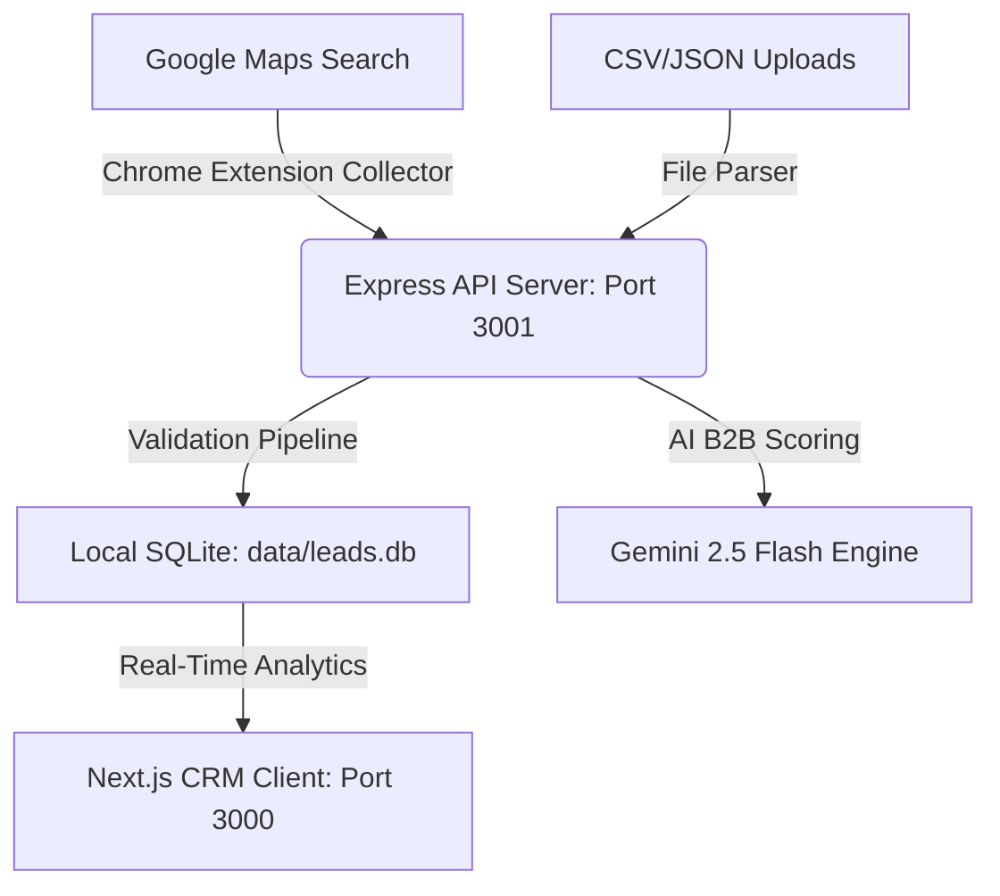

# LeadCap — B2B AI Lead Intelligence OS (v5.0)

LeadCap is a production-grade B2B lead intelligence operating system and CRM built for modern sales pipelines. It is designed to discover local business leads, perform deterministic data validation, assess business quality using a 5-dimension scoring engine, generate personalized AI outreach pitches (powered by Google Gemini), and import leads on-the-fly directly from Google Maps using a dedicated Chrome Extension.

---

## ⚡ Quick Start (Fresh Clone)

LeadCap is pre-configured with a root-level workspace manager. You can set up the entire project—including both backend and frontend applications—with just two commands:

### 1. Install All Dependencies
Run this in the root folder of the cloned repository. It will automatically run npm install in the root, backend, and frontend directories sequentially:
```bash
npm install
```

### 2. Run the Development Servers
Start both the Express backend and Next.js frontend concurrently under a single unified console:
```bash
npm run dev
```

*   **Backend Server**: Online at `http://localhost:3001`
*   **Frontend Dashboard**: Reachable at `http://localhost:3000`

---

## 🏗️ System Architecture



*   **Frontend**: Next.js (App Router), TypeScript, Tailwind CSS, Framer Motion.
*   **Backend**: Node.js, Express, TypeScript, tsx.
*   **Database**: SQLite (`sql.js` in-memory database with persistent buffer disk write-backs to `./data/leads.db`).
*   **AI Engine**: Google Gemini API (`gemini-2.5-flash` for high-speed analysis and sales copy creation).
*   **Browser Scraping**: Manifest V3 Chrome Extension + optional Playwright cloud integrations.

---

## ⚙️ Environment Variables Setup

Both applications are configured with robust `.env.example` templates. Follow these steps to configure your environment:

### 1. Backend (`backend/.env`)
Create a file named `.env` inside the `backend` folder and populate it:
```env
PORT=3001
NODE_ENV=development
DATABASE_PATH=./data/leads.db
FRONTEND_URL=http://localhost:3000

# AI Provider (Required for B2B Scoring, Analysis & Outreach generation)
GEMINI_API_KEY=AIzaSyD0...

# Optional Cloud Scraper (For fallback search discovery)
APIFY_API_TOKEN=apify_api_...

# Optional Web Enricher (For extraction of emails & socials from business websites)
FIRECRAWL_API_KEY=fc-...
```

### 2. Frontend (`frontend/.env.local`)
Create a file named `.env.local` inside the `frontend` folder and populate it:
```env
NEXT_PUBLIC_API_URL=http://localhost:3001/api
```

---

## 🧩 Installing the Google Maps Chrome Scraper

LeadCap comes bundled with a dedicated Manifest V3 Chrome Extension located in the `/chrome-extension` directory. This extension scrapes business info directly from active Google Maps search results and uploads them straight to your CRM queue.

### Setup Instructions:
1. Open **Google Chrome** (or any Chromium browser like Microsoft Edge, Brave, or Opera).
2. Navigate to `chrome://extensions/`.
3. In the top-right corner, toggle **Developer mode** to **ON**.
4. In the top-left corner, click **Load unpacked**.
5. Select the **`chrome-extension`** directory from your cloned LeadCap project path:
   `...\lead cap\chrome-extension`
6. Open Google Maps (`https://www.google.com/maps`) and search for local listings (e.g., *"Salons in Thrissur"*).
7. Open the extension popup, choose your scan target quantity, and click **⚡ Collect & Scroll**!
8. Click **🚀 Import to Lead CRM** to load them instantly into your dashboard.

---

## 📂 Available Package Scripts

The workspace manager provides convenient commands from the project root:

| Command | Action |
| :--- | :--- |
| `npm install` | Restores dependencies for the root, `backend/`, and `frontend/` folders. |
| `npm run dev` | Spins up the frontend and backend development servers concurrently. |
| `npm run build` | Compiles the backend (`tsc`) and builds the frontend production bundle. |
| `npm run build:backend` | Compiles the backend source files into `/dist`. |
| `npm run build:frontend` | Generates the static Next.js production build. |

---

## 🛡️ Production & Security Safeguards

This project is hardened and configured for safe public version control:
*   **Zero-Crash Resilience**: Backend services utilize global uncaught boundary catch blocks and safe lazy loading. If provider tokens (like `GEMINI_API_KEY`) are missing, the system downgrades features gracefully and returns clean JSON error status responses instead of throwing fatal process crashes.
*   **Safe Versioning**: All local SQLite files (`leads.db`), system artifacts, cache logs, next build assets, and local `.env` keys are fully protected by a comprehensive root-level `.gitignore`.
*   **No Hardcoded Secrets**: All API services parse dynamic runtime processes rather than committing keys or static host URLs to repository history.

---

## 🔧 Troubleshooting

### 1. `Gemini API key is not configured`
*   Ensure that you have created the `backend/.env` file with a valid `GEMINI_API_KEY`.
*   If the backend is running, restart it to allow the dev process to load the newly created environment variables.

### 2. `Could not connect to the backend server`
*   Make sure the backend is active on port `3001`. You can check server status in the **System Diagnostics** overlay at the bottom right of the CRM dashboard.
*   Ensure you have run `npm install` inside the root directory to restore the workspace dependencies properly.
